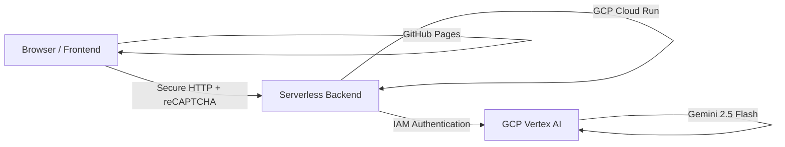

# Mechatronics & AI Engineer Portfolio

A premium, interactive personal portfolio website showcasing mechatronics, robotics, and computer vision projects. It features an integrated AI Chatbot that can answer questions about my resume and skills.

---

## 🛠️ System Architecture

This repository uses a decoupled, secure, serverless architecture:



* **Frontend**: A responsive static site hosted on **GitHub Pages** (`https://pwick15.github.io`).
* **Backend**: A modular Node.js API hosted on **Google Cloud Run** (`https://portfolio-chatbot-xxx.run.app`).
* **AI Engine**: Google Vertex AI utilizing the unified `@google/genai` SDK to run the **Gemini 2.5 Flash** model.
* **Security**: Protected against API abuse using **Google reCAPTCHA v3** and Express IP Rate Limiting, running completely keyless via GCP IAM roles.

---

## 📂 Repository Structure

```
├── assets/                  # CSS images, profile icons, and resume PDF
├── index.html               # Main frontend page layout
├── style.css                # Custom CSS variables, transitions, and animations
├── script.js                # Frontend animations, scroll-spy, and chatbot engine
├── backend/                 # Node.js serverless container source code
│   ├── src/                 # Express backend API & Vertex AI service
│   ├── Dockerfile           # Deployment container definition
│   └── README.md            # Detailed backend setup, running, & deployment guide
└── README.md                # Project overview (this file)
```

---

## 🚀 Getting Started

* To set up, run, or deploy the chatbot server, follow the step-by-step instructions in the [Backend README](file:///Users/punjayawickramasinghe/dev/portfolio-website/backend/README.md).
* To edit the frontend website, modify the root HTML/CSS/JS files and push directly to GitHub to trigger the automated GitHub Pages deployment.

---

## 🌟 Credits

Foundation project structure inspired by [@Ade-mir](https://github.com/Ade-mir).